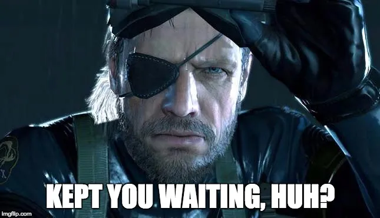

# OpenCode Agent Configuration Guide



This repository contains OpenCode AI agent configurations, mission planning system, and agent skills. This guide is for agentic coding agents working within this repository.

## Repository Structure

```
├── agents/          # Agent definition files (agent-name.md)
├── commands/        # Custom command definitions (command-name.md)
├── skills/          # Reusable agent skills (skill-name/SKILL.md)
└── opencode.jsonc   # OpenCode configuration
```

**Note**: All mission tracking uses folder-based system (`.mission/` directory). Mission Manager MCP service is deprecated.

## Agents

The agents in this repository are named after characters from the **Metal Gear Solid** series, drawing inspiration from the Patriots AI system. Each name represents a distinct operational capability:

| Agent | Mode | Role | Specialty |
|-------|------|------|-----------|
| **big-boss** | Primary | Mission Execution | Executes missions, creates execution logs and reports |
| **eva** | Primary | Visualization | Interactive HTML diagrams, Mermaid visualizations, code explanations |
| **general-zero** | Primary | Mission Planning | Creates mission briefs and task lists |
| **ocelot** | Subagent | Quality Assurance | Code review, validation, issue detection |
| **otacan** | Subagent | Intelligence | Research, documentation lookup, codebase reconnaissance |
| **raiden** | Primary | Direct Execution | Fast task completion with confirmation |
| **sigint** | Primary | Version Control | Git operations, commits, branch management |

### Character Backgrounds

#### big-boss
Named after the legendary soldier and founder of FOXHOUND. Big Boss represents ultimate military leadership and strategic command.

**Agent Capabilities:**
- Executes missions created by General Zero
- Creates and maintains `charlie.md` (execution log) during missions
- Generates `delta.md` (success report) or `echo.md` (failure report) on completion
- Has full access to `write`, `edit`, and `bash` tools for code execution
- Triggered by `/start-mission` command

#### eva
Named after the elite spy and master of infiltration from Operation Snake Eater. EVA represents stealth reconnaissance and discrete, non-intrusive operations.

**Agent Capabilities:**
- **Interactive HTML Visualizations**: Generates self-contained HTML files with Mermaid diagrams
- **Diagram Types**: Architecture diagrams, dependency graphs, file structure trees, flow diagrams
- **Interactive Features**: Pan/zoom support (svg-pan-zoom), search/filter UI, export to PNG/SVG
- **Code Explanation Skills**:
  - `html-code-explanation`: Interactive HTML with syntax highlighting and code walkthroughs
  - `pdf-code-explanation`: Engaging PDF documents explaining code in informal style
- Outputs stored in `docs/visualizations/` directory

#### general-zero
Named after Major Zero (David Oh), founder of the Patriots and master strategist. Zero represents supreme command and information architecture.

**Agent Capabilities:**
- Creates mission plans directly after user approval
- Generates `alpha.md` (mission brief and context)
- Generates `bravo.md` (complete task list for execution)
- **Constraint**: Can ONLY write to `.mission/` directory (enforced by tools)
- Can delegate research to Otacon for codebase reconnaissance
- Sets active mission for Big Boss to execute

#### ocelot
Named after Revolver Ocelot, the master interrogator and triple agent known for analytical brilliance. Ocelot represents interrogation, analysis, and quality assurance.

**Agent Capabilities:**
- Code review and quality validation of completed work
- Creates `review.md` reports with issue classification (CRITICAL/WARNING/INFO/PASS)
- Security scanning (credentials, injection, XSS, authentication)
- Code quality checks (syntax, logic, error handling, memory leaks)
- Integration verification (tests, backward compatibility, dependencies)
- Triggered after Big Boss creates DELTA or via `/review` command

#### otacan
Named after Hal Emmerich (Otacon), the brilliant scientist and engineer who designed Metal Gear REX. Otacon represents technical expertise and research.

**Agent Capabilities:**
- **Read-only reconnaissance** - never modifies files
- **Context7 Integration**: Query up-to-date documentation for any library/framework
- **Brave Search Intelligence**: Web research and current information gathering
- **Codebase Exploration**: File pattern matching and content search
- Thoroughness levels: quick, medium, very thorough
- Called by General Zero (mission planning) and Raiden (direct task research)

#### raiden
Named after the cybernetically-enhanced ninja and protagonist of MGS2. Raiden represents direct, lightning-fast execution.

**Agent Capabilities:**
- Direct task execution without mission planning overhead
- **Confirmation-first approach**: Always asks before modifying files or running commands
- Can delegate research to Otacon for intelligence gathering
- Has `edit`, `bash`, and `web_fetch` tools (all require confirmation)
- Free read/search access without confirmation
- Ideal for quick, single-purpose tasks

#### sigint
Named after Donald Anderson, DARPA director and communications expert. Sigint represents technical diagnostics and version control operations.

**Agent Capabilities:**
- Git operations specialist with safety-first approach
- **Smart Commits**: Semantic commit messages with proper formatting
- **Branch Management**: Create, switch, merge branches safely
- **Status Reports**: Clear summary of staged/unstaged changes
- **Safety Rules**: Never force push, hard reset, or delete unmerged branches without explicit confirmation
- Commands: `/git-status`, `/git-commit`, `/git-branch`, `/git-log`
- Integrates with Ocelot for post-review commits

---

### Agent Workflow

```
User Request
     │
     ▼
┌─────────────────┐
│  General Zero   │ ◄─── Otacon (research)
│ (Mission Plan)  │
└────────┬────────┘
         │ Creates ALPHA + BRAVO
         ▼
┌─────────────────┐
│    Big Boss     │ ◄─── Otacon (reconnaissance)
│ (Execute Tasks) │
└────────┬────────┘
         │ Creates CHARLIE → DELTA
         ▼
┌─────────────────┐
│     Ocelot      │
│  (Code Review)  │
└────────┬────────┘
         │ Creates review.md (PASS)
         ▼
┌─────────────────┐
│     Sigint      │
│ (Git Commit)    │
└─────────────────┘
```

**Alternative: Direct Execution**
```
User Request → Raiden → (asks Otacon if needed) → Confirm → Execute
```

**Alternative: Visualization**
```
User Request → EVA → Generate HTML/PDF → Output to docs/visualizations/
```

## Docker Configuration

This section details the Docker setup for the Mission Manager MCP Server.

### Multi-Stage Build
The `Dockerfile` now uses a multi-stage build process to create optimized and smaller Docker images. This process separates build-time dependencies from runtime dependencies, resulting in a more efficient and secure final image.

### Security Hardening
To enhance security, the container runs as a non-root user (`bun` with UID 1001). This minimizes potential attack vectors and adheres to the principle of least privilege.

### Resource Limits
Resource limits are configured in `docker-compose.yml` to ensure the Mission Manager operates within defined CPU and memory constraints, preventing resource exhaustion on the host system.

- **CPU Limit**: 1.0 core
- **Memory Limit**: 512MB

### Port Configuration
The Mission Manager MCP Server now runs on **port 8765** instead of the default 3000. This non-standard port choice improves security by making the service less discoverable to automated scans targeting common ports.

- **Environment Variable**: `PORT=8765`
- **Exposed Port**: `8765:8765` in `docker-compose.yml`

### Health Checks
Robust health checks are implemented to monitor the container's status. The health endpoint can be accessed at `http://localhost:8765/health`.

```bash
curl http://localhost:8765/health
```

### Docker Commands

**Build the Docker Image**:
```bash
docker build -t mission-manager:1.1.0 .
```

**Run with Docker Compose**:
```bash
docker-compose up -d
```

**Troubleshooting Port Issues**:
If you encounter issues with port 8765, ensure:
1. The `PORT` environment variable is correctly set.
2. The `ports` mapping in `docker-compose.yml` is accurate.
3. Your firewall allows incoming connections on port 8765.

